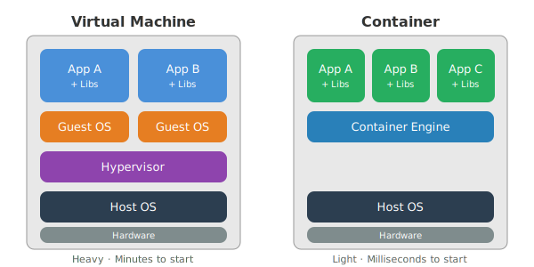

# Containers & Images

## What is a Container?

A container is a **lightweight, isolated process** that shares the host's kernel but has its own:
- Filesystem (via image layers)
- Network interface
- Process namespace
- Resource limits (CPU, memory)

Unlike virtual machines, containers don't need a guest OS — they're fast to start and lightweight.

:::tip
The key mental model: a container is just a process with its own filesystem and network. It's not a VM!
:::

## Containers vs VMs

The following diagram illustrates the key architectural differences between containers and virtual machines:



| Aspect | Container | Virtual Machine |
|--------|-----------|----------------|
| Startup time | Milliseconds | Minutes |
| Size | MBs | GBs |
| Isolation | Process-level | Hardware-level |
| OS | Shares host kernel | Full guest OS |
| Performance | Near-native | Overhead from hypervisor |
| Density | 100s per host | Tens per host |

## Docker Images


An image is a **read-only template** for creating containers. Images are built in **layers**:

```
Layer 4: COPY . /app              (your code)
Layer 3: RUN npm install          (dependencies)
Layer 2: RUN apt-get install ...  (system packages)
Layer 1: FROM node:20-alpine      (base image)
```

Each layer is cached. If a layer hasn't changed, Docker reuses the cached version — making builds fast.

## Essential Commands

### Images

```bash
# Pull an image from Docker Hub
docker pull nginx:alpine

# List local images
docker images

# Remove an image
docker rmi nginx:alpine

# Build an image from Dockerfile
docker build -t myapp:1.0 .

# Tag an image
docker tag myapp:1.0 registry.company.com/myapp:1.0

# Push to a registry
docker push registry.company.com/myapp:1.0
```

### Containers

```bash
# Run a container
docker run -d --name web -p 8080:80 nginx:alpine

# List running containers
docker ps

# List all containers (including stopped)
docker ps -a

# View logs
docker logs web
docker logs -f web       # Follow

# Execute command in running container
docker exec -it web /bin/sh

# Stop and remove
docker stop web
docker rm web

# Remove all stopped containers
docker container prune
```

### Flags for `docker run`

| Flag | Purpose | Example |
|------|---------|---------|
| `-d` | Detached mode (background) | `docker run -d nginx` |
| `-p` | Port mapping host:container | `-p 8080:80` |
| `--name` | Assign a name | `--name web` |
| `-e` | Set environment variable | `-e DB_HOST=postgres` |
| `-v` | Mount volume | `-v ./data:/app/data` |
| `--rm` | Remove when stopped | `docker run --rm alpine` |
| `--network` | Attach to network | `--network my-net` |
| `--restart` | Restart policy | `--restart unless-stopped` |

## Image Registries

| Registry | URL | Use Case |
|----------|-----|----------|
| Docker Hub | hub.docker.com | Public images |
| GitHub Container Registry | ghcr.io | GitHub projects |
| Amazon ECR | *.dkr.ecr.*.amazonaws.com | AWS workloads |
| Google Artifact Registry | *-docker.pkg.dev | GCP workloads |
| Harbor | self-hosted | Enterprise private registry |

## Summary

:::warning
Never store sensitive data (passwords, API keys) in Docker images. Use environment variables or secrets management instead.
:::

Containers provide consistent, reproducible environments from development to production. Images are the blueprints, containers are the running instances. Master `docker run`, `docker build`, and `docker logs` — they're your daily tools.
