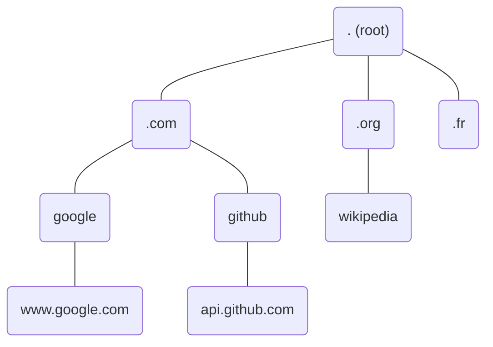
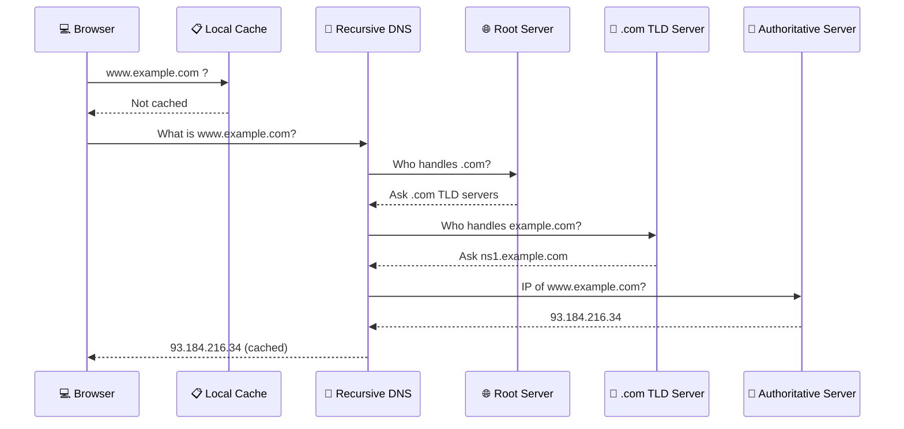

# How DNS Works

## The Problem DNS Solves

Computers communicate using IP addresses like `142.250.74.238`. Humans prefer names like `google.com`. DNS bridges this gap by **translating domain names into IP addresses**.

Without DNS, you would need to memorize IP addresses for every website — like memorizing phone numbers instead of using a contact list.

## The DNS Hierarchy

DNS is organized as a **tree**, with the root at the top:



Each level is called a **zone**, managed by different organizations:

| Level | Example | Managed By |
|-------|---------|-----------|
| **Root** | `.` | ICANN (13 root server clusters) |
| **TLD** (Top-Level Domain) | `.com`, `.org`, `.fr` | Registry operators (Verisign, AFNIC, etc.) |
| **Domain** | `google.com` | The domain owner (Google) |
| **Subdomain** | `mail.google.com` | The domain owner |

## The Resolution Process

When you type `www.example.com` in your browser, here's what happens:



This entire process typically takes **less than 100 milliseconds** and involves 3–4 network round-trips. Thanks to caching, most lookups are resolved much faster.

## Key Actors

| Actor | Role | Example |
|-------|------|---------|
| **Stub resolver** | Your device's DNS client | Built into your OS |
| **Recursive resolver** | Does the heavy lifting — follows the chain | 8.8.8.8 (Google), 1.1.1.1 (Cloudflare) |
| **Authoritative server** | The source of truth for a domain | ns1.example.com |

## DNS Caching and TTL

Every DNS response includes a **TTL** (Time To Live) — the number of seconds the answer can be cached.

```
www.example.com  →  93.184.216.34  (TTL: 300 seconds)
```

This means: "you can reuse this answer for 5 minutes without asking again."

- **Short TTL** (60–300s) — Changes propagate quickly, but more DNS queries
- **Long TTL** (3600–86400s) — Fewer queries, but changes take hours to propagate

When migrating a server, a common practice is to **lower the TTL a few days before**, make the change, then raise the TTL back.

## Common DNS Tools

```bash
# Look up a domain's IP address
dig www.example.com

# Simpler lookup
nslookup www.example.com

# Quick lookup (common on Linux)
host www.example.com
```

As a DevOps engineer, you'll use `dig` frequently to troubleshoot DNS issues.
