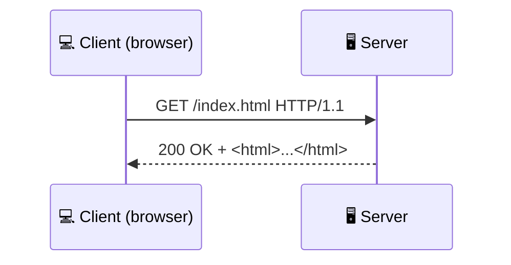

# The HTTP Protocol

## What is HTTP?

**HTTP** (HyperText Transfer Protocol) is the protocol your browser uses to communicate with web servers. Every time you load a web page, submit a form, or call an API, HTTP is at work.

HTTP follows a simple **request-response** model:



## Anatomy of an HTTP Request

```
GET /api/users?page=2 HTTP/1.1
Host: api.example.com
User-Agent: Mozilla/5.0
Accept: application/json
Authorization: Bearer eyJhbGciOi...
```

| Part | Description |
|------|-------------|
| **Method** | What action to perform (`GET`) |
| **Path** | The resource being requested (`/api/users?page=2`) |
| **Version** | HTTP version (`HTTP/1.1`) |
| **Headers** | Metadata about the request (key-value pairs) |
| **Body** | Optional data sent with the request (for POST, PUT) |

## HTTP Methods

| Method | Purpose | Has Body? | Idempotent? |
|--------|---------|-----------|-------------|
| **GET** | Retrieve data | No | Yes |
| **POST** | Create a resource | Yes | No |
| **PUT** | Replace a resource entirely | Yes | Yes |
| **PATCH** | Partially update a resource | Yes | No |
| **DELETE** | Delete a resource | Rarely | Yes |
| **HEAD** | Like GET but returns only headers | No | Yes |
| **OPTIONS** | Discover allowed methods | No | Yes |

**Idempotent** means calling it multiple times has the same effect as calling it once. `GET /users/42` always returns the same user. `DELETE /users/42` deletes the user — calling it again changes nothing.

## Anatomy of an HTTP Response

```
HTTP/1.1 200 OK
Content-Type: application/json
Content-Length: 85
Cache-Control: max-age=3600

{"id": 42, "name": "Alice", "email": "alice@example.com"}
```

| Part | Description |
|------|-------------|
| **Status code** | Numeric result (`200`) |
| **Reason phrase** | Human-readable status (`OK`) |
| **Headers** | Metadata about the response |
| **Body** | The actual content (HTML, JSON, image, etc.) |

## Status Codes

Status codes are grouped by their first digit:

### 2xx — Success

| Code | Meaning |
|------|---------|
| **200** | OK — request succeeded |
| **201** | Created — new resource was created |
| **204** | No Content — success, but nothing to return |

### 3xx — Redirection

| Code | Meaning |
|------|---------|
| **301** | Moved Permanently — use the new URL from now on |
| **302** | Found — temporarily at another URL |
| **304** | Not Modified — use your cached version |

### 4xx — Client Error

| Code | Meaning |
|------|---------|
| **400** | Bad Request — malformed syntax |
| **401** | Unauthorized — authentication required |
| **403** | Forbidden — authenticated but not allowed |
| **404** | Not Found — resource doesn't exist |
| **409** | Conflict — request conflicts with current state |
| **429** | Too Many Requests — rate limit exceeded |

### 5xx — Server Error

| Code | Meaning |
|------|---------|
| **500** | Internal Server Error — generic server failure |
| **502** | Bad Gateway — proxy received invalid response |
| **503** | Service Unavailable — server overloaded or in maintenance |
| **504** | Gateway Timeout — upstream server didn't respond in time |

> **As a DevOps engineer, you'll monitor these codes constantly.** A spike in 5xx errors means your service is broken. A spike in 4xx might mean clients are sending bad requests or hitting rate limits.

## Common Headers

| Header | Direction | Purpose |
|--------|-----------|---------|
| `Content-Type` | Both | Data format (`application/json`, `text/html`) |
| `Authorization` | Request | Authentication credentials |
| `User-Agent` | Request | Client identification (browser, curl, etc.) |
| `Cache-Control` | Response | Caching instructions |
| `Set-Cookie` | Response | Store data on the client |
| `Cookie` | Request | Send stored cookies back |
| `Content-Length` | Both | Size of the body in bytes |
| `Location` | Response | URL for redirections (3xx) |

## HTTP Versions

| Version | Year | Key Feature |
|---------|------|-------------|
| **HTTP/1.0** | 1996 | One request per connection |
| **HTTP/1.1** | 1997 | Keep-alive connections, chunked transfer |
| **HTTP/2** | 2015 | Multiplexing (many requests over one connection), binary format |
| **HTTP/3** | 2022 | Uses QUIC (UDP-based), faster connection setup |

Most web traffic today uses **HTTP/2** or **HTTP/3**. But the request/response model and status codes remain the same across all versions.
