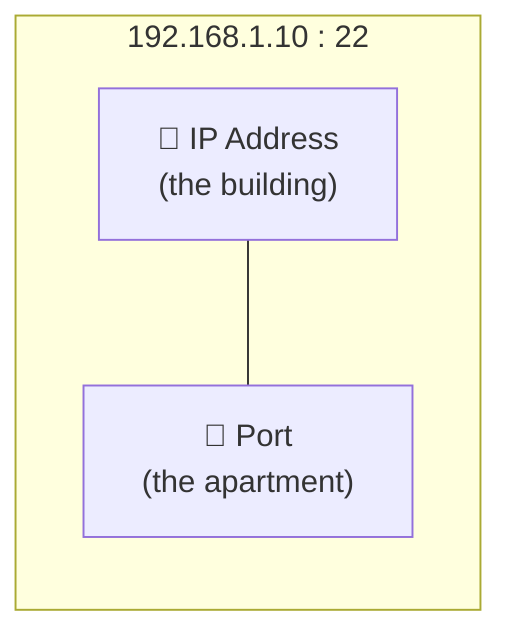
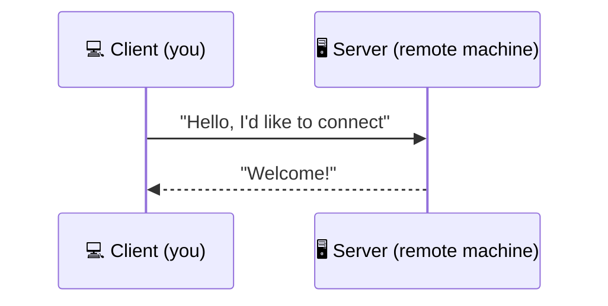
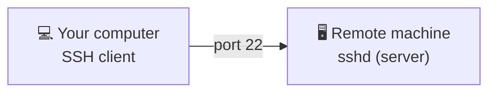
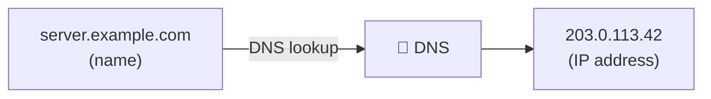

# Networking basics

Before diving into SSH, it's important to understand a few basics about how computer networks work. Don't worry, we'll take it step by step! 🙂

---

## What is an IP address?

An **IP address** is like a **mailing address** for a computer on a network. Just as the mail carrier needs your address to deliver a letter, computers need an IP address to send data to each other.

### The IPv4 format

An IP address (in version 4, the most common) looks like this:

```
192.168.1.100
```

It's a series of **4 numbers separated by dots**, each ranging from 0 to 255.

### Local and public addresses

There are two main categories of IP addresses:

| Type | Example | Usage |
|------|---------|-------|
| **Local address** (private) | `192.168.1.100` | Used within your network (at home, at the office) |
| **Public address** | `203.0.113.42` | Visible on the Internet, assigned by your Internet Service Provider |

> 💡 Think of your local address as a room number in a hotel, and the public address as the hotel's street address.

### localhost — talking to yourself

There is a special address: **`127.0.0.1`**, also known as **`localhost`**. It always refers to **your own machine**.

It's a bit like sending a letter to yourself: it never leaves your home.

```
localhost = 127.0.0.1 = "myself"
```

---

## What is a port?

Now that we know how to find a computer using its IP address, we need a way to distinguish the **different services** running on that machine. That's what a **port** is for.

> 🏢 **Analogy**: imagine an apartment building. The IP address is **the building's address**. The port is the **apartment number**. You need both to know exactly where to go.



A port is a number between **0 and 65535**.

### Most common ports

| Port | Service | Description |
|------|---------|-------------|
| **22** | SSH | Secure remote access to a machine |
| **80** | HTTP | Web pages (not secure) |
| **443** | HTTPS | Web pages (secure, with the padlock 🔒) |

### Why port 22 matters for SSH

Port **22** is the default port used by SSH. When you connect to a remote machine via SSH, your computer contacts port 22 on that machine. It's like knocking on the door of apartment #22 in the building.

---

## The Client / Server model

Most network communications follow a simple model: the **client** and the **server**.

> 🏪 **Analogy**: think of a bakery.
> - The **server** is the bakery: it's open and **waiting for customers to come in**.
> - The **client** is you: you **decide to go there** to buy some bread.



### How does it work with SSH?

In the case of SSH:

- **Your machine** is the **client**: you are the one who decides to connect.
- **The remote machine** is the **server**: it runs a program called **`sshd`** (the "d" stands for *daemon*, a program that runs in the background and waits for connections).



---

## What is a protocol?

A **protocol** is a set of **communication rules** that two machines agree to follow in order to understand each other.

> 🗣️ **Analogy**: it's like a **common language**. If you speak English and the other person speaks English too, you can communicate. A protocol is the same idea: both machines agree on "how" to exchange information.

### Some common protocols

| Protocol | Usage |
|----------|-------|
| **HTTP** | Browsing web pages |
| **HTTPS** | Browsing web pages securely |
| **SSH** | Connecting remotely to a machine, securely |
| **FTP** | Transferring files between machines |

SSH is particularly important because all communications are **encrypted**: no one can eavesdrop on what travels between your machine and the server.

---

## What about DNS?

**DNS** (*Domain Name System*) is the service that translates **human-readable names** (like `server.example.com`) into **IP addresses** (like `203.0.113.42`), much like a phone book for the Internet.



Thanks to DNS, you don't need to memorize strings of numbers: a name is all you need!

---

## Summary

| Concept | In one sentence |
|---------|-----------------|
| **IP address** | A computer's mailing address on the network |
| **localhost** | The special address that refers to your own machine (`127.0.0.1`) |
| **Port** | The apartment number — identifies a specific service on a machine |
| **Client / Server** | The client initiates the connection, the server waits for it |
| **Protocol** | The rules of the game so that two machines can understand each other |
| **DNS** | The directory that translates names into IP addresses |

You now have all the basics you need to understand how SSH works. Let's move on! 🚀
