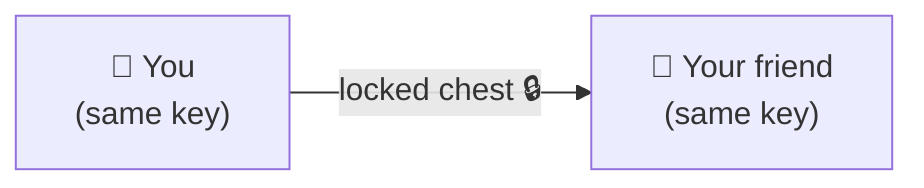
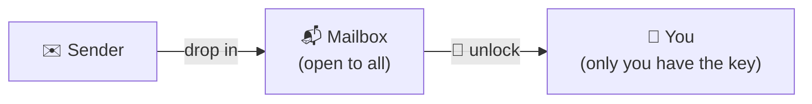
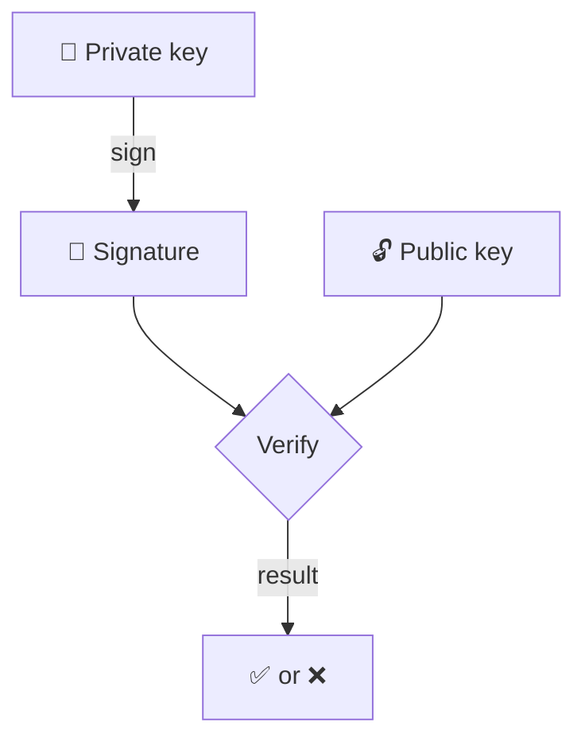
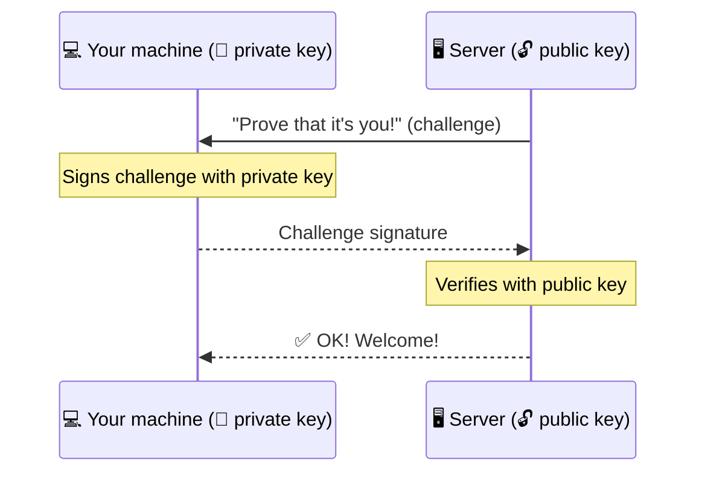
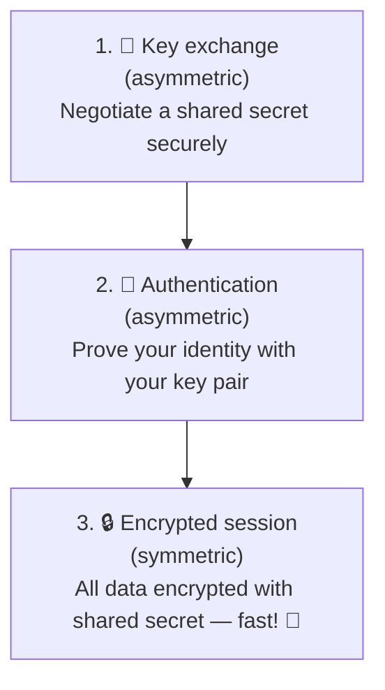

# Cryptography Without the Headache

Don't panic! You **don't need to be a mathematician** to understand
cryptography. We're just going to skim over the big principles — the ones that
will help you understand how SSH works. We promise, it'll be fine. 😊

---

## Symmetric encryption: one key for everything

The idea is simple: **the same key** is used to lock (encrypt) **and**
unlock (decrypt) a message.

### Analogy: the shared padlock

Imagine a chest with a padlock. You and your friend both have **the same
copy of the key**. You put a message in the chest, you lock the padlock,
and only your friend (who has the same key) can open it.

**Advantage**: it's fast and efficient.

**Problem**: how do you transmit the key to your friend **securely**?
If someone intercepts the key during transfer, they'll be able to read all your
messages. This is the well-known **key exchange problem**.

---

## Asymmetric encryption: two keys that go hand in hand

To solve this problem, we use **two different keys** that work
together:

| Key | Role | Who has it? |
|-----|------|-------------|
| **Public key** | Encrypt a message (or verify a signature) | Anyone can have it |
| **Private key** | Decrypt a message (or sign) | **You alone** |

### Analogy #1: the mailbox

Think of your mailbox:

- **Anyone** can slip a letter in (= encrypt with your public key).
- **You alone** have the key to open it and read the mail (= decrypt with
  your private key).

### Analogy #2: the open padlock

You hand out **open padlocks** (your public key) to everyone.
Anyone can lock a chest with your padlock, but **you alone**
have the small key that opens it (your private key).

### The golden rules

- ✅ The **public key** is shared freely — stick it everywhere if you want.
- 🔒 The **private key** stays **secret** — **never** share it.
- 🧮 You **cannot** derive the private key from the public key.
  It's mathematically designed to be impossible (in practice).

---

## Digital signatures: proving it's really you

Sometimes, you don't want to hide a message, but rather **prove who sent it**.
That's the role of the digital signature.

### Analogy: the wax seal

In the Middle Ages, letters were sealed with a personal **wax seal**:

- **Everyone** can look at the seal and verify that it's authentic.
- **Only the owner** of the seal can create it.

In summary:

- You **sign** with your private key (the seal belongs only to you).
- Anyone **verifies** the signature with your public key.
- If the verification succeeds → it was indeed you who signed. ✅

### And in SSH?

When you connect to a server with SSH, here's what happens
(simplified):

1. The server sends a **challenge** (a random message).
2. Your machine **signs** it with your private key.
3. The server **verifies** the signature with your public key.
4. If it checks out → you're authenticated. Welcome! 🎉

Your private key **never leaves your machine**. Only the proof (the
signature) is transmitted.

---

## How SSH uses all of this

SSH combines both types of encryption in a clever way:

| Step | Encryption type | Why? |
|------|-----------------|------|
| Key exchange | Asymmetric | Agree on a secret without an eavesdropper seeing it |
| Authentication | Asymmetric | Prove who you are with your private key |
| Session data | Symmetric | Encrypt fast — symmetric is much faster |

Symmetric encryption is used for the session because it's **much
faster** than asymmetric. Asymmetric is mainly used at the start, to establish
trust and exchange the secret securely.

---

## Key takeaway

You don't need to remember the mathematical details. The important thing is to
understand the principle: **public key = share freely, private key =
keep secret**.

That's it! You now have the foundations to understand how SSH protects
your connections. 🔐
