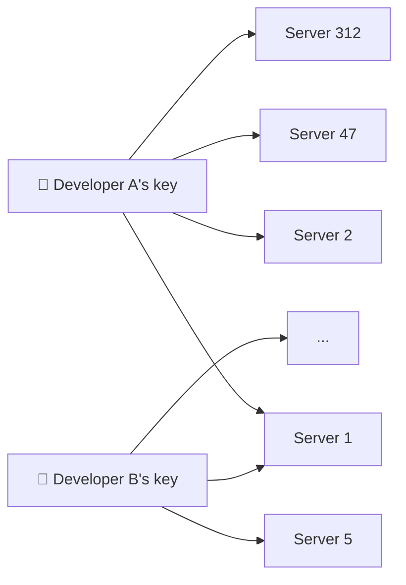
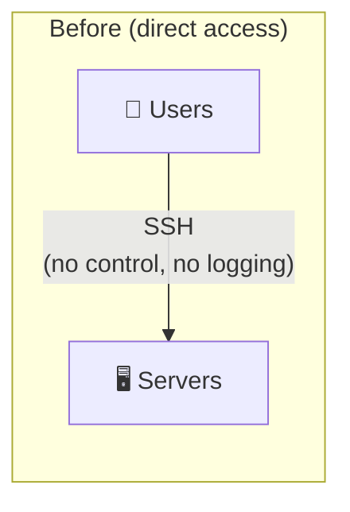
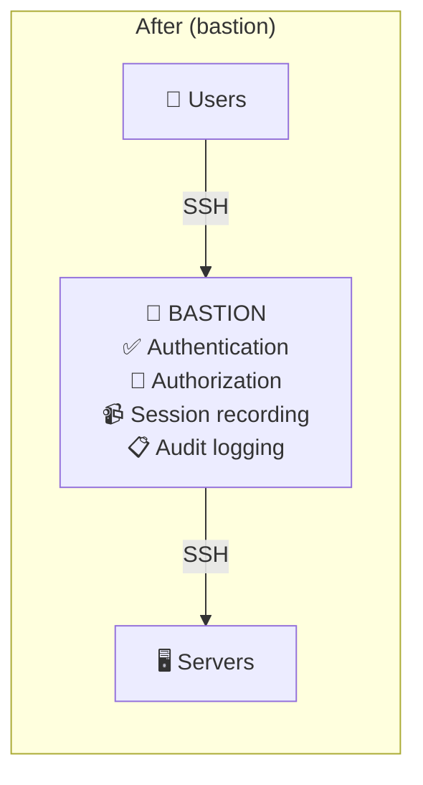

# Why Bastions Exist

## The Problem: Too Many Servers, Too Many People

In a real-world infrastructure, you might have:
- 500 servers across production, staging, and development
- 50 people who need SSH access (developers, ops, DBAs, contractors)
- Different access levels: devs access staging, only ops access production

Without a centralized solution, managing this is a nightmare:

> When Developer A leaves: remove their key from ALL servers 😱

### Real Problems

- **Who has access to what?** No centralized view
- **Revoking access** requires touching every server
- **No audit trail** — who connected where and when?
- **Key rotation** — how do you force key updates?
- **Compliance** — PCI-DSS, ISO 27001 require access logging

## The Bastion Solution

A **bastion host** (also called **jump host**) is a single, hardened server that acts as the **mandatory gateway** for all SSH connections.

### Key Principles

1. **Single entry point** — All SSH traffic goes through the bastion
2. **No direct access** — Servers only accept connections from the bastion's IP
3. **Protocol break** — Two separate SSH connections (user→bastion, bastion→server). The bastion is not a transparent proxy.
4. **Centralized management** — Users, groups, and permissions are managed on the bastion

### What You Gain

| Feature | Without Bastion | With Bastion |
|---------|----------------|-------------|
| Access management | Per-server `authorized_keys` | Centralized on bastion |
| Revoke access | Touch every server | One command on bastion |
| Audit trail | Parse logs on each server | Centralized logs |
| Session recording | Not available | Built-in |
| Group-based access | Manual | Native support |
| Key rotation | Manual, rarely done | Enforced policies |
| Compliance | Very hard | Built-in |
