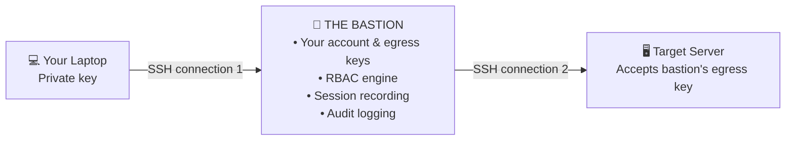
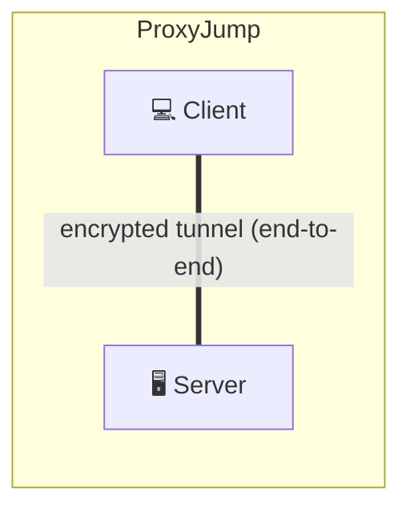
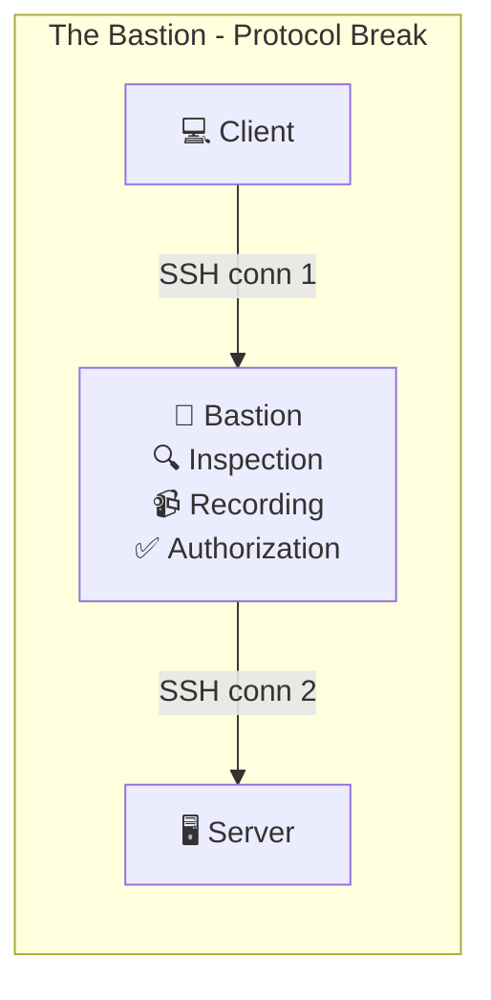

# The Bastion by OVH

## What is The Bastion?

**The Bastion** is an open-source SSH bastion developed and used in production by **OVH** (one of Europe's largest cloud providers). It's available on GitHub at [github.com/ovh/the-bastion](https://github.com/ovh/the-bastion) under the Apache 2.0 license.

OVH uses The Bastion to manage SSH access across their massive infrastructure, handling tens of thousands of servers and thousands of users.

## Architecture

### Key Concepts

- **Ingress key**: Your public key registered on the bastion (to authenticate you)
- **Egress key**: A key generated by the bastion for your account (used to connect to target servers)
- **Personal access**: Direct permission for you to reach a specific user@server
- **Group access**: Permission granted to a group; all group members can access the servers
- **Protocol break**: Two separate SSH connections — the bastion is NOT a transparent tunnel

### Protocol Break Explained

Unlike `ProxyJump` (which creates an end-to-end tunnel), The Bastion terminates the SSH connection and opens a new one:

Why protocol break? Because the bastion can:
- **Record the session** (what you typed and saw)
- **Log every command** (audit trail)
- **Enforce access policies** in real-time
- **Terminate sessions** if needed

## Role-Based Access Control (RBAC)

The Bastion supports several roles:

| Role | Can Do |
|------|--------|
| **User** | Connect to authorized servers |
| **Group Owner** | Manage group members and server access |
| **Group Gate Keeper** | Approve/deny access requests |
| **Group ACL Keeper** | Manage which servers the group can access |
| **Bastion Admin** | Full control over the bastion |

## Key Features

- **Multi-OS support** — Linux, FreeBSD
- **Session recording** — Every session is recorded with `ttyrec`
- **MFA support** — TOTP, YubiKey, Duo
- **Self-service** — Users can manage their own keys
- **PIV/FIDO2** — Hardware security key support
- **SCP/SFTP/Rsync** — File transfer through the bastion
- **Realtime logs** — Searchable audit trail
- **Production hardened** — Battle-tested at OVH scale
